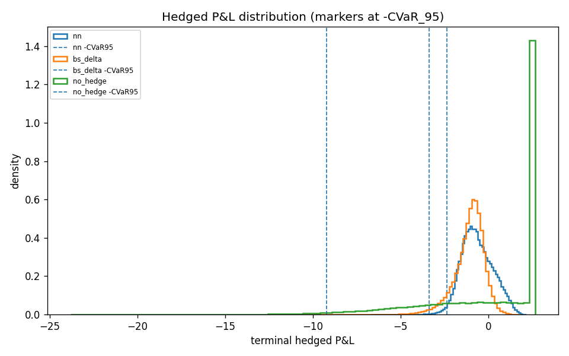

# Deep Hedging

Learn option-hedging strategies that beat Black-Scholes delta hedging on tail risk
under realistic frictions — discrete rebalancing, proportional transaction costs,
stochastic volatility (Heston) and jumps (Bates). A neural hedger is trained by
backpropagating through a fully-simulated, differentiable price trajectory and
minimizing a convex risk measure (CVaR / entropic) of terminal P&L
(Buehler, Gonon, Teichmann & Wood, 2019).



*Terminal P&L under Heston + transaction costs: the learned policy (lower CVaR95) vs
Black-Scholes delta hedging.*

## What it does

- **Simulators:** GBM, Heston (full-truncation Euler), Merton & Bates jump-diffusion.
- **Pricing:** Black-Scholes + a semi-analytic Heston pricer (characteristic function +
  Carr-Madan), used to mark a second hedging instrument for vega hedging.
- **Risk-measure losses:** CVaR (Rockafellar-Uryasev) and entropic, hand-written and
  differentiable, optimized jointly with the hedge network.
- **Result:** lower tail risk (CVaR95/99) than BS delta hedging under frictions, plus a
  learned no-transaction band around delta (Whalley-Wilmott 1997).

## Install

```bash
pip install -e .
```

## Reproduce

```bash
# Train + evaluate a regime and write metrics:
python scripts/run_experiment.py heston_costs figures/

# Regenerate all figures (the money-shot + the hedge-ratio band plot):
python scripts/make_figures.py heston_costs figures/
```

Regimes: `gbm`, `gbm_costs`, `heston_costs`, `bates_costs`, `multi_instrument`.

## More

- Full results + regime table + commentary: [report.md](report.md).
- Design & methodology (with verified quant formulas): [docs/specs/2026-06-10-deep-hedging-design.md](docs/specs/2026-06-10-deep-hedging-design.md).
