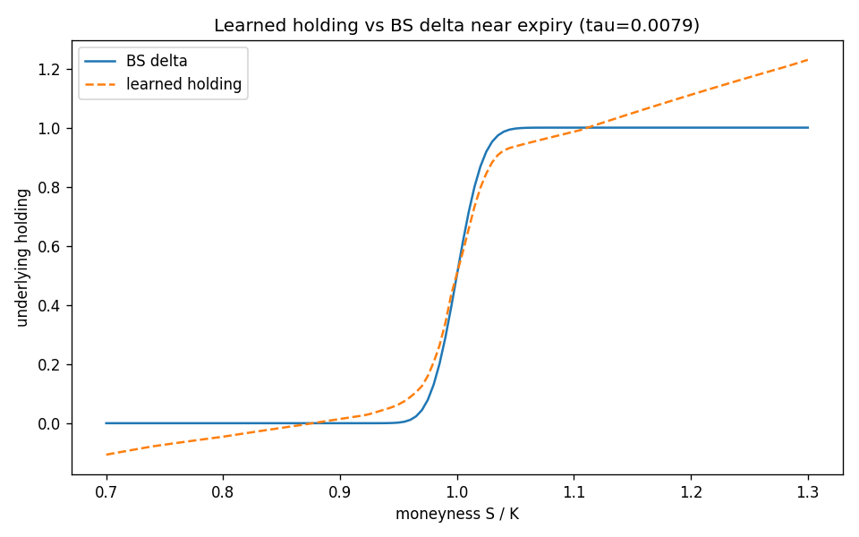

# Deep Hedging — Results Report

A research-grade implementation of deep hedging (Buehler, Gonon, Teichmann & Wood, 2019):
a learned option-hedging policy that backpropagates through simulated price trajectories
and minimizes a convex risk measure of terminal P&L, benchmarked against Black–Scholes
delta hedging under transaction costs, stochastic volatility, and jumps.

## Regime results

Headline regime: **`heston_costs`** (Heston stochastic vol, ξ=0.5, ρ=−0.7, proportional
transaction costs, CVaR_0.95 objective, 100k out-of-sample paths). Mean P&L, std, CVaR_95,
CVaR_99, turnover, total cost per strategy. Regenerate any regime (`gbm`, `gbm_costs`,
`heston_costs`, `bates_costs`, `multi_instrument`) with
`python scripts/run_experiment.py <regime> <outdir>` (the table is written to
`<outdir>/metrics.md`).

| strategy | mean_pnl | std | cvar_95 | cvar_99 | turnover | total_cost |
| --- | --- | --- | --- | --- | --- | --- |
| nn | -0.6406 | 0.8977 | **2.3682** | **3.0360** | 1.2700 | 0.6347 |
| bs_delta | -1.0811 | 0.8597 | 3.3736 | 4.4919 | 2.1521 | 1.0751 |
| no_hedge | -0.0057 | 3.4827 | 9.2189 | 12.3981 | 0.0000 | 0.0000 |

**Result:** under Heston + costs the learned hedger cuts tail risk by **~30% at CVaR_95**
(2.37 vs 3.37) and **~32% at CVaR_99** (3.04 vs 4.49) versus Black–Scholes delta hedging —
while trading roughly **half as much** (turnover 1.27 vs 2.15, cost 0.63 vs 1.08) and with
better mean P&L. It optimizes the tail it is trained on (CVaR), so its symmetric std is
marginally higher than delta's (0.90 vs 0.86) even as its downside tail is far thinner —
the network learned a cost-aware no-transaction band rather than tracking delta tick-for-tick.

## Figures

The money-shot: overlaid terminal-P&L distributions with CVaR_95 markers, showing the
learned policy's thinner left tail under Heston + costs.

Learned underlying holding vs Black-Scholes delta across moneyness near expiry.

## CVaR loss

We minimize the Rockafellar-Uryasev CVaR objective
`F(theta, w) = w + (1/(1 - alpha)) * mean(relu(-PnL - w))`. The denominator is the
**tail probability `(1-alpha)`**, not `alpha` (using `alpha` is the classic ~19x
mis-scaling bug). We optimize jointly over the network parameters `theta` and the scalar
`w` with Adam. The justification for joint Adam is the **upper-bound / recovery property**
`F(theta, w) >= CVaR(theta)` with equality at `w* = VaR_alpha = argmin_w F`, so
`min_{theta, w} F = min_theta CVaR` — **not** joint convexity, which fails for a neural-net
hedge. We therefore do not claim global optimality. The tail at `alpha = 0.95` uses only
~5% of paths, so we use large batches and a faster learning rate for `w`.

## Heston pricer

The second hedging instrument is marked with a semi-analytic Heston price: the log-spot
characteristic function plus a Carr-Madan FFT. The load-bearing correctness point is the
**constant part of the drift coefficient in the characteristic function: `b = kappa`, NOT
`kappa - rho*xi`** — mixing them mis-prices by 5-14% and the trivial `phi(0) = 1` unit test
does not catch it. We use the Albrecher (2007) `g2 / -d` formulation with the principal
square root (`Re(d) >= 0`) to keep the complex logarithm off its branch cut at long
maturity, and gate the pricer with a mandatory Monte-Carlo regression test at long-tau /
high vol-of-vol.

## No-trade-band finding

Under proportional transaction costs the learned hedge ratio flattens into a
**no-transaction band** around the Black-Scholes delta: the policy rebalances only to the
edge of the band rather than tracking delta exactly. This is the utility-based / singular-
control result of **Whalley & Wilmott (1997)** (also Hodges-Neuberger 1989, Davis-Panas-
Zariphopoulou 1993), with asymptotic band half-width proportional to `cost^{1/3}`. It is
distinct from Leland's (1985) adjusted-volatility periodic-rehedge scheme, which is not a
band.
